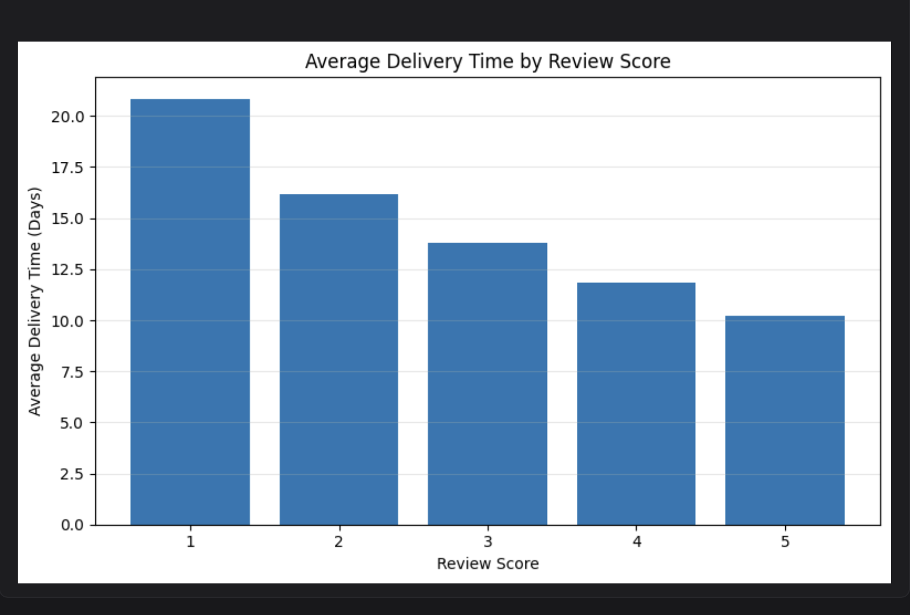
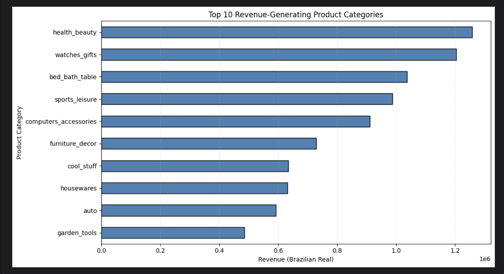
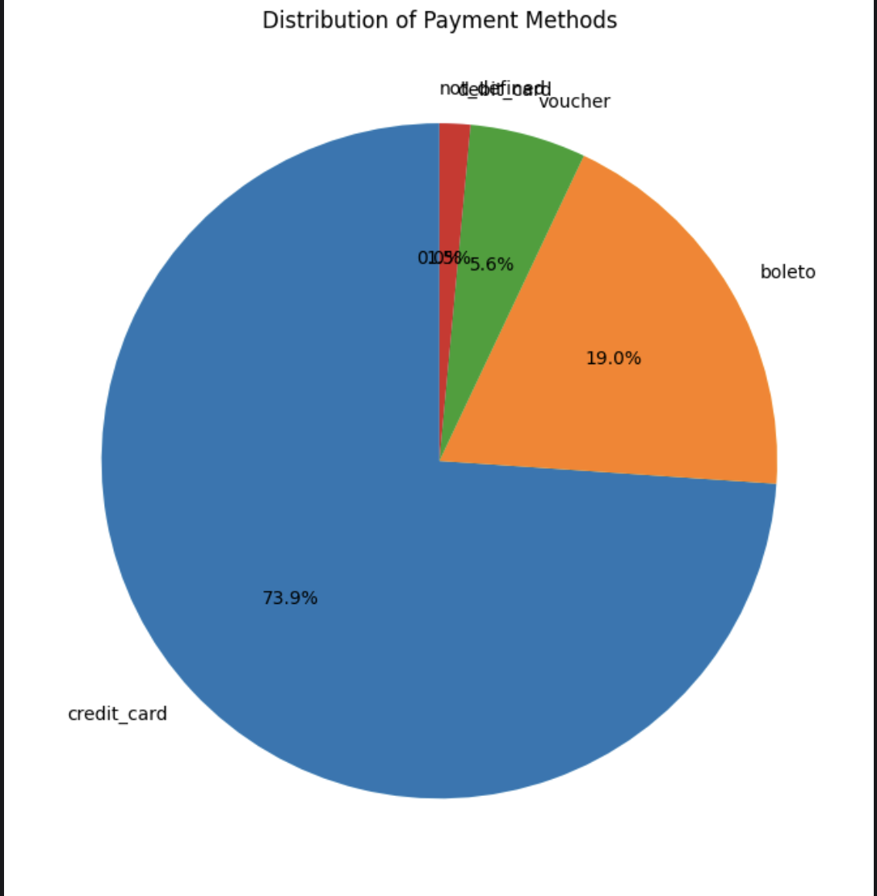

# 📊 Brazilian E-Commerce Business Analytics


> **Turning 100,000+ real-world e-commerce transactions into actionable business insights through analytics, visualization, and AI-assisted reasoning.**

## ⭐ Project at a Glance

| Project | Details |
|---------|---------|
| Domain | E-Commerce Analytics |
| Dataset | Brazilian Olist Public Dataset |
| Records Analyzed | 100,000+ Orders |
| Language | Python |
| Libraries | Pandas, Matplotlib |
| Platform | Zerve |
| Analysis Type | Exploratory Data Analysis (EDA) |

> End-to-end Business Analytics project using **Python**, **Pandas**, **Matplotlib**, and **Zerve AI** to analyze customer behavior, revenue drivers, delivery performance, and payment preferences using the Brazilian Olist E-Commerce dataset.

---

## 📌 Project Overview

This project explores the **Brazilian Olist E-Commerce Public Dataset** to answer practical business questions that support operational and strategic decision-making.

The analysis combines **exploratory data analysis**, **data integration**, **feature engineering**, and **AI-assisted business reasoning** to generate actionable insights from real-world transactional data.

---

## 🎯 Business Questions

### 🚚 1. Does delivery time influence customer satisfaction?

<p align="center">

</p>

**Finding**

Customers experiencing longer delivery times consistently provided lower review scores.

**Business Impact**

Improving logistics and delivery efficiency can directly improve customer satisfaction.

---

### 💰 2. Which product categories generate the highest revenue?

<p align="center">

</p>

Top Categories

- Health & Beauty
- Watches & Gifts
- Bed, Bath & Table
- Sports & Leisure
- Computers & Accessories

**Business Impact**

Revenue is concentrated in a small number of product categories, providing opportunities for targeted inventory planning and marketing.

---

### 💳 3. Which payment methods do customers prefer?

<p align="center">

</p>

Results

- Credit Card (~74%)
- Boleto (~19%)
- Voucher (~6%)
- Debit Card (~1.5%)

**Business Impact**

Optimizing the checkout experience for the dominant payment methods can improve conversion and customer experience.

---

# 🛠 Tech Stack

- Python
- Pandas
- Matplotlib
- Zerve
- Exploratory Data Analysis
- Business Analytics

---

# 🤖 AI Usage

AI was used as an analytical assistant throughout the project to support ideation and interpretation rather than replace the analytical process.

Specifically, Zerve AI was used to:

- Refine business questions
- Validate analytical findings
- Generate business recommendations

All data preparation, feature engineering, visualizations, and conclusions were independently developed and verified using Python.

---

# 📂 Repository Structure

```text
.
├── images/
├── README.md
├── LICENSE
└── .gitignore
```
---

# 🚀 Future Improvements

- Interactive Power BI / Tableau dashboard
- Customer segmentation
- Regional sales analysis
- Demand forecasting
- Seller performance analysis
- Customer lifetime value analysis

---

# 📄 Dataset

The analysis uses the **Brazilian Olist Public E-Commerce Dataset**, a real-world relational dataset containing over **100,000 orders** and multiple interconnected tables covering customers, orders, products, payments, reviews, and sellers.

Available through the Zerve platform.

---

## 📌 Skills Demonstrated

- Exploratory Data Analysis
- Business Analytics
- Data Cleaning
- Data Integration
- Feature Engineering
- Data Visualization
- Business Storytelling
- AI-assisted Analytics
  
---

# 🌐 Live Project

### 📓 Interactive Notebook

https://app.zerve.ai/notebook/547d8cdd-98e0-4928-b05a-ee7df41cd37b

### 📄 Interactive Report

https://app.zerve.ai/report/be09505f-8725-4836-8056-f4f9b20fe99f

---

# 👩‍💻 Author

# 📬 Contact

**Sanjana Reddy Gangula**

🎓 Master's Student — Business Analytics

California State University, East Bay

📧 gangulasanjanareddy@gmail.com

💼 LinkedIn: www.linkedin.com/in/sanjanagangula
